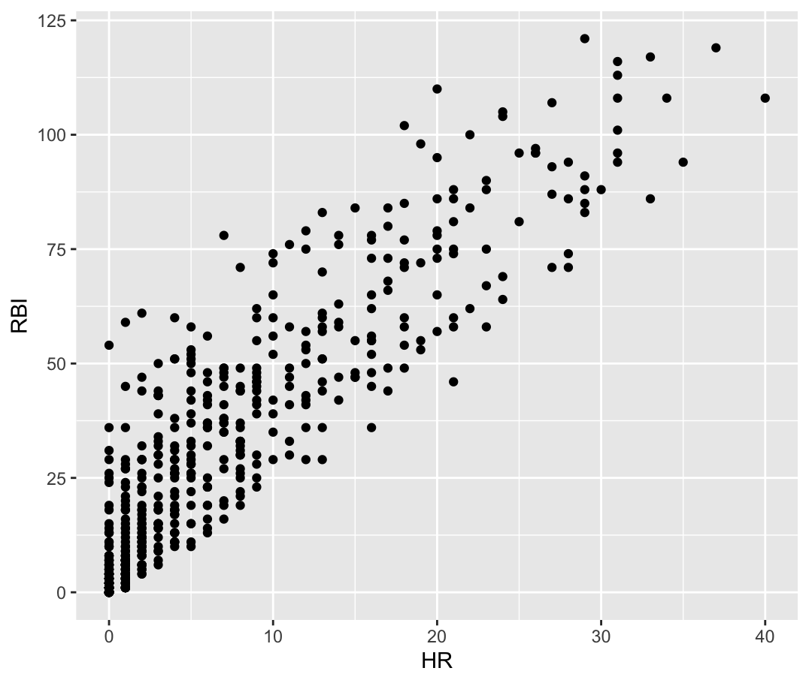
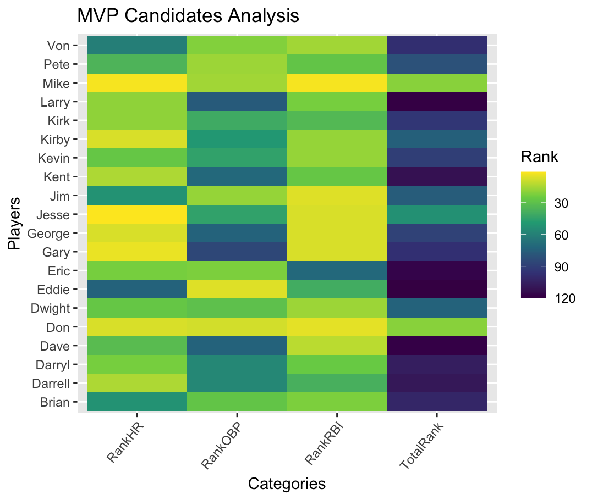

# **Baseball Statistics EDA**

## **📌 Project Overview**
This project performs **Exploratory Data Analysis (EDA)** on baseball statistics. The dataset contains various performance metrics of baseball players, including hits, home runs, runs, and batting averages. The analysis identifies key insights, trends, and relationships between variables, helping to assess player performance and rankings.

## **📂 Dataset Information**
- **2015.csv**: Contains happiness metrics for different countries.
- **baseball.csv**: Includes statistics of baseball players, such as at-bats (AB), home runs (HR), runs (R), hits (H), and batting averages (BA).

### **📊 Key Variables in Baseball Dataset**
| Variable | Description |
|----------|------------|
| `Age` | Age of the player |
| `G` | Number of games played |
| `PA` | Plate appearances |
| `AB` | At-bats |
| `H` | Hits made by the player |
| `HR` | Home runs |
| `RBI` | Runs Batted In |
| `BA` | Batting Average |
| `OBP` | On-Base Percentage |

## **🔍 Analysis Steps**
### **1️⃣ Data Cleaning and Preprocessing**
- Read and clean data to ensure consistency.
- Removed players with **0 at-bats** to ensure meaningful analysis.

### **2️⃣ Exploratory Data Analysis (EDA)**
- **Summarization**: Identified trends and distributions.
- **Filtering**: Selected top-performing and low-performing players.
- **Aggregating**: Computed group-wise statistics (e.g., by age).

### **3️⃣ Data Visualization**
This project uses different types of visualizations to showcase insights from the baseball dataset.

#### **📷 Scatter Plot: Home Runs vs. RBIs**
Illustrates the relationship between home runs and runs batted in (RBIs), helping to identify power hitters.

#### **📊 MVP Heatmap Analysis**
A heatmap visualizing rankings across multiple performance metrics to determine the most valuable player (MVP).

## **🤝 Contributing**
If you’d like to contribute, feel free to share feedback or improvements.

## **📜 License**
This project is licensed under the MIT License.

---
🚀 **Enjoy exploring Baseball Statistics!**

